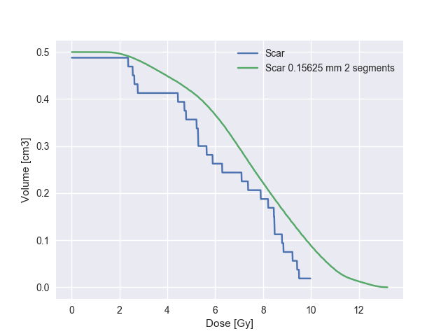

=====
Usage
=====

To use dicompyler-core in a project:

DICOM data can be easily accessed using convenience functions using the :mod:`dicompylercore.dicomparser.DicomParser` class:

.. code-block:: python

    from dicompylercore import dicomparser, dvh, dvhcalc
    dp = dicomparser.DicomParser("rtss.dcm")

    # i.e. Get a dict of structure information
    structures = dp.GetStructures()

    >>> structures[5]
    {'color': array([255, 128, 0]), 'type': 'ORGAN', 'id': 5, 'empty': False, 'name': 'Heart'}

Dose volume histogram (DVH) data can be accessed in a Pythonic manner using the :mod:`dicompylercore.dvh.DVH` class:

.. code-block:: python

    rtdose = dicomparser.DicomParser("rtdose.dcm")
    heartdvh = dvh.DVH.from_dicom_dvh(rtdose.ds, 5)

    >>> heartdvh.describe()
    Structure: Heart
    -----
    DVH Type:  cumulative, abs dose: Gy, abs volume: cm3
    Volume:    437.46 cm3
    Max Dose:  3.10 Gy
    Min Dose:  0.02 Gy
    Mean Dose: 0.64 Gy
    D100:      0.00 Gy
    D98:       0.03 Gy
    D95:       0.03 Gy
    D2cc:      2.93 Gy

    >>> heartdvh.max, heartdvh.min, heartdvh.D2cc
    (3.0999999999999779, 0.02, dvh.DVHValue(2.9299999999999815, 'Gy'))

Dose volume histograms (DVHs) can be independently calculated using the :mod:`dicompylercore.dvhcalc` module:

.. code-block:: python

    # Calculate a DVH from DICOM RT data
    calcdvh = dvhcalc.get_dvh("rtss.dcm", "rtdose.dcm", 5)

    >>> calcdvh.max, calcdvh.min, calcdvh.D2cc
    (3.0899999999999999, 0.029999999999999999, dvh.DVHValue(2.96, 'Gy'))

Structure and dose data for independently calculated DVHs can also be interpolated in-plane and between planes:

.. code-block:: python

    # Calculate a DVH using interpolation to super-sample the dose grid in plane,
    # interpolate dose between planes and restrict calculation to the structure
    # extents
    interpscar = dvhcalc.get_dvh("rtss.dcm", "rtdose.dcm", 8,
        interpolation_resolution=(2.5/16),
        interpolation_segments_between_planes=2,
        use_structure_extents=True)
    interpscar.name += ' interp'

    # Compare against un-interpolated DVH
    origscar = dvhcalc.get_dvh("rtss.dcm", "rtdose.dcm", 8)

    >>> origscar.compare(interpscar)
    Structure:          Scar            Scar interp       Rel Diff       Abs diff
    -----
    DVH Type:  cumulative, abs dose: Gy, abs volume: cm3
    Volume:             0.47 cm3          0.50 cm3         +6.55 %          +0.03
    Max:                9.50 Gy          13.18 Gy         +38.74 %          +3.68
    Min:                2.36 Gy           1.23 Gy         -47.88 %          -1.13
    Mean:               6.38 Gy           7.53 Gy         +18.02 %          +1.15
    D100:               0.00 Gy           0.00 Gy          +0.00 %          +0.00
    D98:                2.36 Gy           2.44 Gy          +3.39 %          +0.08
    D95:                2.36 Gy           3.09 Gy         +30.93 %          +0.73
    D2cc:               0.00 Gy           0.00 Gy          +0.00 %          +0.00

Dose grids can be summed and scaled using the :mod:`dicompylercore.dose` module:

.. code-block:: python

    from dicompylercore import dose

    # Dose grid summation with (tri-linear) interpolation if dose grids are not spatially coincident
    grid_1 = dose.DoseGrid(dose_file_1)
    grid_2 = dose.DoseGrid(dose_file_2)
    grid_sum = grid_1 + grid_2
    grid_sum.save_dcm("grid_sum.dcm")  # save to file

    # Dose grid scaling
    grid_scaled = grid_1 * 2  # Scale grid_1 by a factor of 2
    grid_scaled.save_dcm("grid_scaled.dcm")  # save to file

    # Dose grid subtraction may be performed, however, negative doses are not currently
    # DICOM compliant (i.e., the pixel_array of RTDOSE datasets are unsigned integer arrays).
    # dicompyler-core users must work with the DoseGrid's numpy array directly (DoseGrid.dose_grid)
    dose_diff_direct = grid_1.dose_grid - grid_2.dose_grid
    dose_diff_interp = grid_1.dose_grid - grid_1.interp_entire_grid(grid_2)

